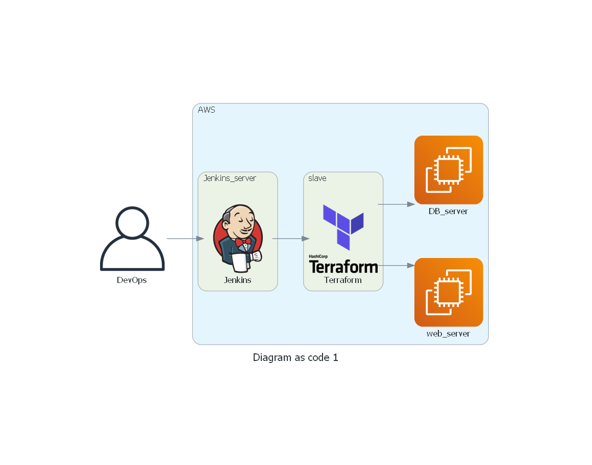
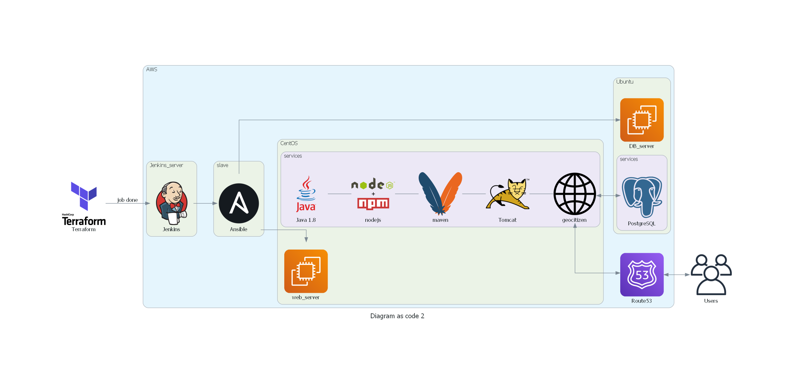

# Geocitizen

1. [Manual deploy Geocitizen](#manual_deploy_geocitizen)
2. [ubuntu20.04](#ubuntu20.04)
3. [centos7](#centos7)
4. [Diagram as code](#diagram_as_code)

## Manual deploy Geocitizen 

1) `git clone git@github.com:DevOpsAcademySS/Geocitizen.git; cd Geocitizen`
1) in [`pom.xml`](https://git.io/JuGgS) file change port from `http` to `https` in [`this`](https://git.io/JuGgS) line
1) in config file [`~/Geocitizen/src/main/resources/application.properties`](https://git.io/JuGlO)
	Edit following properties
	 * [`front.url`](https://git.io/JuGWH) - front url
	 * [`db.url`](https://git.io/JuGWA) - db uri (__db must be created manually__)
1) replace url with tomcat's url (e.g. `'http://51.138.200.208:8080/citizen'`) in [`~/Geocitizen/front-end/src/main.js`](https://git.io/JuGlP)
1) `mvn install && mv target/citizen.war /usr/share/tomcat9/webapps/ && /usr/share/tomcat9/bin/startup.sh`
1) e.g. <http://51.138.200.208:8080/citizen/>

## Ubuntu 20.04 

Install PostgreSQL, create database 'ss_demo_1', add password, garint all privileges on database

edit following files:
    
in `/etc/postgresql/12/main/pg_hba.conf` write `host all all 192.168.1.7/24 md5`

in `/etc/postgresql/12/main/postgresql.conf ` replace `listen_addresses='localhost'` with `listen_addresses='*'`

## CentOS 7 

Install OpenJDK, create Tomcat system user, download and configure Tomcat

## Diagram as code 

Diagram 1 :

Diagram  2 :

#
    
[Geocitizen](http://51.138.200.208:8080/citizen/swagger-ui.html)

